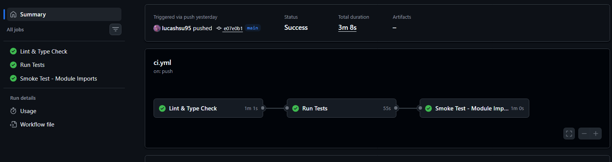
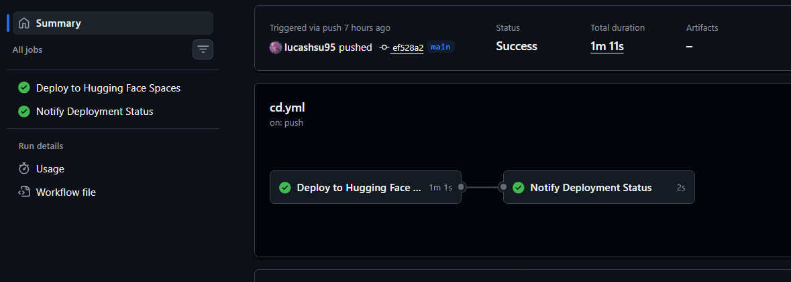

<style>
/* 內嵌主題樣式 */

section {
  font-family: "Noto Sans TC", "PingFang TC", "Microsoft JhengHei", sans-serif;
  background: radial-gradient(
    circle at 15% 20%,
    #e0f2fe 0%,
    #f8fafc 40%,
    #eef2ff 100%
  );
  color: #0f172a;
  padding: 56px 72px;
  line-height: 1.45;
  font-size: 30px;
  text-align: left;
}

h1,
h2,
h3 {
  color: #0b3b8c;
  letter-spacing: 0.4px;
}

h1 {
  font-size: 2.35em;
  margin-bottom: 0.25em;
}

h2 {
  font-size: 1.62em;
  border-left: 8px solid #38bdf8;
  padding-left: 14px;
}

h3 {
  font-size: 1.24em;
}

code {
  background: #e2e8f0;
  color: #0b3b8c;
  border-radius: 6px;
}

pre {
  border: 1px solid #cbd5e1;
  border-radius: 10px;
  box-shadow: 0 8px 26px rgba(15, 23, 42, 0.08);
}

section::after {
  color: #334155;
  font-weight: 700;
  font-size: 0.65em;
}

section footer {
  left: 30px;
  right: auto;
  bottom: 16px;
  font-size: 0.58em;
  font-weight: 700;
  color: #0b3b8c;
  background: rgba(255, 255, 255, 0.82);
  border: 1px solid #bae6fd;
  border-radius: 999px;
  padding: 4px 10px;
}

section.lead {
  background: linear-gradient(135deg, #082f49 0%, #0f766e 55%, #0369a1 100%);
  color: #f8fafc;
  text-align: center;
  justify-content: center;
}

section.lead h1,
section.lead h2,
section.lead h3,
section.lead p {
  color: #f8fafc;
}

section.dark {
  background: linear-gradient(145deg, #0f172a 0%, #1e293b 60%, #0f766e 100%);
  color: #e2e8f0;
}

section.dark h2,
section.dark h3,
section.dark strong {
  color: #7dd3fc;
}

section.tiny {
  font-size: 0.82em;
}

.columns {
  display: flex;
  gap: 24px;
  margin-top: 10px;
  align-items: start;
}

.card {
  flex: 1;
  border: 1px solid #bfdbfe;
  border-radius: 12px;
  padding: 14px 16px;
}

section img {
  max-width: 100%;
  height: auto;
  border-radius: 10px;
  box-shadow: 0 8px 24px rgba(15, 23, 42, 0.16);
}
</style>

<!-- _class: lead -->
<!-- _paginate: skip -->
# MLOps FTI
## 從特徵到上線的完整閉環

預測標的：AAPL
預測任務：5 日超額報酬率（相對 SPY）

---

## 這個專案解決三個問題

**Training-Serving Skew（訓練推論不一致）。** 訓練和推論用不同的特徵計算邏輯，模型上線後表現變差。這種情況很常見，因為特徵工程散落在各處，沒有統一管理。

---

> 💡 **什麼是訓練？什麼是推論？**
> - **訓練**：餵資料給模型，讓它學習規律（像學生讀書）
> - **推論**：用訓練好的模型做預測（像學生考試）

**退步模型上線。** 新模型看起來比舊模型好，但實際上只是過擬合訓練資料。沒有穩定的驗證機制，就無法保證上線的模型真的有進步。

> 💡 **什麼是過擬合？**
> 模型把訓練資料「背起來」了，而不是真的學到規律。就像學生把考古題答案背起來，換個題目就不會了。

**流程不可持續。** 每次更新模型都要手動跑一堆腳本，時間一久就沒人願意維護。最後模型停在原地，資料也跟著過時。

---

<!-- footer: Feature Pipeline -->

## 專案架構

```
yfinance（資料源）
→ Feature Pipeline → Hopsworks Feature Store
→ Training Pipeline → Hopsworks Model Registry
→ Inference Pipeline（Modal 排程）
→ Gradio UI（Hugging Face Spaces）
```

---

> 💡 **這條鏈路在做什麼？**
> - **Feature Pipeline**：抓資料、算特徵（準備食材）
> - **Feature Store**：存特徵的倉庫（冰箱）
> - **Training Pipeline**：訓練模型（煮菜）
> - **Model Registry**：存模型的櫃子（食譜本）
> - **Inference Pipeline**：用模型做預測（上菜）

這條鏈路的核心思想很簡單：**特徵只算一次，訓練和推論共用同一套邏輯。**

Hopsworks 當 Feature Store 和 Model Registry，Modal 負責排程推論，Hugging Face Spaces 跑前端介面。每個環節都有對應的 CI/CD 自動化。

---

## Feature Pipeline：把特徵做對

<div class="columns">
<div class="card">

### 核心職責

1. 抓取 AAPL、SPY、QQQ、VIX 價格資料
2. 計算技術指標和市場脈絡特徵
3. 寫入 Feature Store 供訓練與推論共用

**重點**：同一套邏輯，訓練和推論都要用。

</div>
<div class="card">

### 實作架構

```text
yfinance（資料源）
↓
計算技術指標（RSI, MACD, BB）
↓
Hopsworks Feature Store
```

</div>
</div>

---

> 💡 **什麼是特徵？**
> 特徵就是模型的「輸入資料」。比如預測股價，特徵可能是：過去 5 天漲幅、成交量變化、RSI 指標等。好的特徵能讓模型更容易學到規律。

---

## 共享模組：避免邏輯分叉

<div class="columns">
<div class="card">

### 為什麼需要共享？

- `src/features.py` 放一份計算邏輯
- Feature Pipeline 和 Inference Pipeline 都 import 它
- 改一處，兩邊一起生效

這比「特徵很多」更重要。

</div>
<div class="card">

```python
# src/features.py
def calculate_technical_indicators(
    df: pd.DataFrame
) -> pd.DataFrame:
    delta = df["close"].diff()
    gain = delta.clip(lower=0)
        .rolling(14).mean()
    ...
    return df
```

</div>
</div>

---

## 常數集中管理

<div class="columns">
<div class="card">

### 好處

- 魔術數字集中在 `constants.py`
- 改 RSI 週期？改一個地方就好
- 不用翻遍整個專案找 `14` 出現在哪

時間一久，各處的魔術數字開始不一致，除錯時就很痛苦。

</div>
<div class="card">

```python
# src/constants.py
RSI_PERIOD = 14
MACD_FAST_PERIOD = 12
TRAIN_TEST_SPLIT_RATIO = 0.8
MARKET_TICKERS = {
    "spy": "SPY",
    "qqq": "QQQ",
    "vix": "^VIX"
}
```

</div>
</div>

---

> 💡 **什麼是魔術數字？**
> 程式碼裡直接寫死的數字，像 `14`、`0.8`。問題是沒人知道這些數字哪來的、為什麼是這個值。把它們集中管理並命名，像 `RSI_PERIOD = 14`，程式碼就更容易理解。

---

<!-- footer: Training Pipeline -->

## Training Pipeline：不只是訓練模型

<div class="columns">
<div class="card">

### 三個檢查點

1. **時序切分**：不能 shuffle，按時間先後切分
2. **Walk-Forward**：滾動時間窗評估穩定性
3. **Baseline Gating**：只有打敗 baseline 才上傳

避免「單次指標好看但實際不可用」。

</div>
<div class="card">

```python
# 時序切分（正確做法）
split_idx = int(len(X) * 0.8)
X_train = X.iloc[:split_idx]
X_test = X.iloc[split_idx:]

# Walk-Forward 驗證
for fold in range(5):
    train, test = split_fold(fold)
    evaluate(train, test)
```

</div>
</div>

---

## 時序資料不能 shuffle

<div class="columns">
<div class="card">

### 為什麼？

股票資料有時間順序。用未來的資料訓練、預測過去，模型指標會很好看，但這是作弊。

Walk-Forward 進一步測試不同時間窗的表現，確認模型不是只對特定時期有效。

</div>
<div class="card">

```python
# ✅ 正確做法
split_idx = int(len(X) * 0.8)
X_train, X_test = X.iloc[:split_idx], X.iloc[split_idx:]

# ❌ 錯誤做法——絕對不要用
X_train, X_test = train_test_split(
    X, test_size=0.2
) # 會壞掉
```

</div>
</div>

---

> 💡 **什麼是 shuffle？**
> 隨機打亂資料順序。一般機器學習會這樣做，但時間序列資料（如股價）絕對不能！因為時間有先後順序，用「未來」的資料訓練去預測「過去」，等於偷看答案。

---

## Baseline Gating：未達標不上線

<div class="columns">
<div class="card">

### 機制說明

Baseline 是「不做任何複雜預測」的簡單模型。如果新模型連這個都打不贏，就沒必要上傳到 Model Registry。

這個機制擋掉了很多看起來不錯、實際上退步的模型。

</div>
<div class="card">

```python
mae_pass = metrics["mae"] <= baseline_mae * (1 + tolerance)
rmse_pass = metrics["rmse"] < baseline_rmse
r2_pass = metrics["r2"] > baseline_r2
beats_baseline = mae_pass and rmse_pass and r2_pass
```

</div>
</div>

---

> 💡 **什麼是 Baseline？**
> 最簡單的預測方式，比如「直接預測平均值」或「預測永遠不變」。新模型如果連這種笨方法都贏不了，表示模型有問題，不該上線。

---

<!-- footer: Inference Pipeline -->

## Inference Pipeline：自動排程推論

<div class="columns">
<div class="card">

### 自動化流程

每個交易日台灣時間早上 6 點：

- 系統自動抓最新資料
- 跑推論
- 把預測結果寫回 Feature Store

不需要人為介入。

</div>
<div class="card">

```python
@app.function(
    schedule=modal.Cron("0 22 * * 1-5"),
    timeout=300,
)
def scheduled_inference():
    return run_pipeline()
```

</div>
</div>

> 💡 **Cron 是什麼？**
> 一種排程語法，告訴電腦「什麼時候做什麼」。`"0 22 * * 1-5"` 意思是：每週一到週五的 22:00（UTC）執行。就像設定鬧鐘，每天固定時間響。

---

## CI/CD：讓整個流程可持續

<div class="columns">
<div class="card">

### CI（持續整合）



每次改 code 就自動檢查有沒有問題。

</div>
<div class="card">

### CD（持續部署）



檢查通過後自動上線。

</div>
</div>

---

| 層級 | 內容 |
| ---------- | ------------------------------------------- |
| CI | Ruff linter + pytest + MyPy 型別檢查 |
| CD | app.py 更新時自動部署到 Hugging Face Spaces |
| Retraining | 每週六自動重訓（GitHub Actions 備援） |

> 💡 **什麼是 CI/CD？**
> - **CI（Continuous Integration，持續整合）**：每次改 code 就自動檢查有沒有問題。像寫完作業自動批改，告訴你哪裡錯了。
> - **CD（Continuous Deployment，持續部署）**：檢查通過後自動上線。像批改通過就自動公布答案，不用手動操作。
>
> 沒有 CI/CD：改 code → 手動測試 → 手動部署 → 忘了某個步驟 → 出包
> 有 CI/CD：改 code → 自動檢查 → 自動部署 → 睡覺去

---

這不是為了炫技，而是為了讓專案能長期運作。資料更新 → 推論 → 週期重訓 → 模型更新 → UI 展示，這個循環跑起來後，維護成本就會大幅降低。

> 💡 **什麼是 linter 和型別檢查？**
> - **Linter**：檢查程式碼風格和潛在錯誤（像拼字檢查）
> - **型別檢查**：確保變數型別正確（確保不會把「蘋果」加到「數字」）

---

<!-- _class: lead -->
## 結語

模型分數很重要，但不是唯一重要的事。

「可重複」——每次跑 Pipeline 得到一樣的結果。

「可追蹤」——知道每個模型用了什麼資料、哪些特徵。

「可持續」——流程自動化，不需要每天手動操作。

這三件事做到位，模型上線後才不會變成一場災難。

---

## 專案原始碼

🔗 **GitHub Repository**: [lucashsu95/learn-MLOps-FTI](https://github.com/lucashsu95/learn-MLOps-FTI/tree/main/0315)

所有程式碼、Pipeline 腳本、測試案例都在這裡。歡迎參考與討論。

---

## 附錄：術語速查表

| 術語           | 白話解釋                                             |
| -------------- | ---------------------------------------------------- |
| Feature        | 特徵，模型的輸入資料（像食材）                       |
| Pipeline       | 流程管線，把多個步驟串起來（像生產線）               |
| Training       | 訓練，讓模型學習（像學生讀書）                       |
| Inference      | 推論，用模型做預測（像學生考試）                     |
| Overfitting    | 過擬合，把訓練資料背起來而非學到規律（背考古題）     |
| Baseline       | 基準線，最簡單的預測方式（用來比較新模型有沒有進步） |
| CI             | 持續整合，改 code 自動檢查（自動批改作業）           |
| CD             | 持續部署，檢查通過自動上線（自動公布答案）           |
| Linter         | 程式碼風格檢查器（拼字檢查）                         |
| Cron           | 排程語法，設定什麼時候執行（鬧鐘）                   |
| Shuffle        | 隨機打亂資料順序（時間序列絕對不能做）               |
| Feature Store  | 特徵倉庫，集中管理特徵的地方（冰箱）                 |
| Model Registry | 模型櫃子，集中管理模型的地方（食譜本）               |
